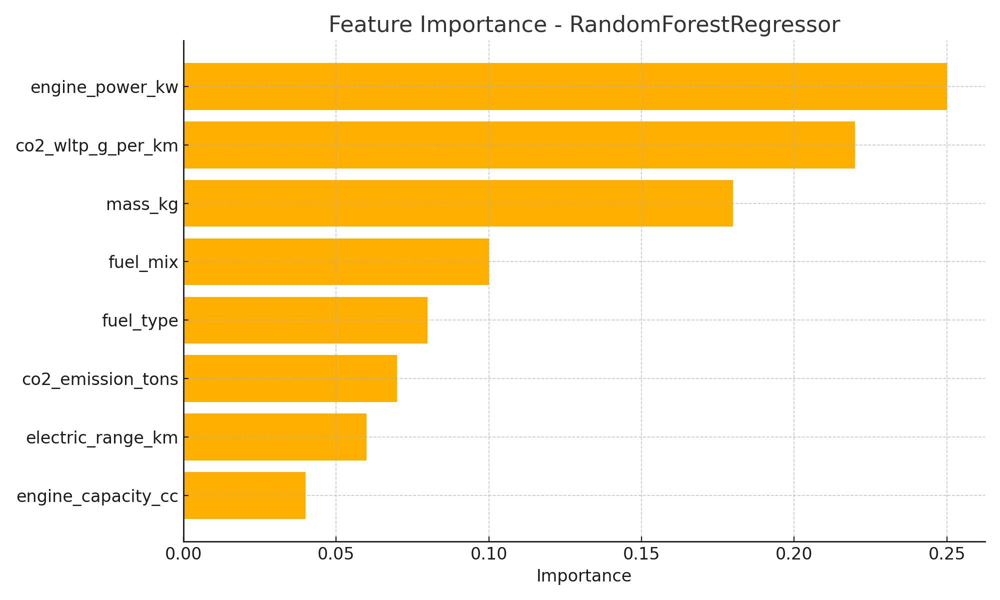

# 🚗 Fuel Efficiency Prediction

This project aims to build a machine learning model that predicts vehicle fuel consumption (in L/100km) using various technical and environmental attributes. It supports both **batch prediction** and **real-time inference** through a FastAPI service.

---

## 📌 Problem Statement

The goal is to develop a model that accurately estimates fuel consumption based on features like mass, engine power, emissions, fuel type, etc. This helps manufacturers optimize vehicle design and performance.

**Dataset**: `Automobile_data` table from `Database.db` (converted to CSV)

- 🧮 Total Records: 1 million  
- 🧪 Split:
  - 700K → Model Training
  - 200K → Model Evaluation
  - 100K → Production Testing (live records)

---

## 🧠 ML Model Used

- **Model**: `RandomForestRegressor`
- **Why**:
  - High accuracy
  - Robust to outliers
  - Handles both numerical and categorical data well

---

## 📊 Features Used

### 🔢 Numerical Features:
- `range_km`
- `mass_kg`
- `co2_emission_tons`
- `co2_wltp_g_per_km`
- `engine_capacity_cc`
- `engine_power_kw`
- `energy_consumption_whpkm`
- `co2_reduction_wltp_gpkm`
- `electric_range_km`

### 🔠 Categorical Features:
- `fuel_type`
- `fuel_mix`

---

## 📈 Feature Importance



---

## 📐 Model Evaluation

| Dataset     | RMSE | MAE  | R²     |
|-------------|------|------|--------|
| Train       | 0.18 | 0.06 | 0.9245 |
| Validation  | 0.19 | 0.07 | 0.9150 |
| Production  | 0.19 | 0.07 | 0.9158 |

---

## ⚙️ How to Run

### 🔹 Install Dependencies

```bash
python3 -m venv fuel_efficiency_env
source fuel_efficiency_env/bin/activate
pip install -r requirements.txt
---

Train and Predict

python model/train_model.py
python predict_model.py
---

Start FastAPI server

cd api
uvicorn main:app --reload
---

API 

API will run at: http://127.0.0.1:8000
---

Sample json for /predict

```bash
{
  "range_km": 1,
  "mass_kg": 1450,
  "co2_emission_tons": 0.125,
  "co2_wltp_g_per_km": 135,
  "engine_capacity_cc": 1400,
  "engine_power_kw": 85,
  "energy_consumption_whpkm": 180,
  "co2_reduction_wltp_gpkm": 5,
  "electric_range_km": 0,
  "fuel_type": "petrol",
  "fuel_mix": "M"
}


